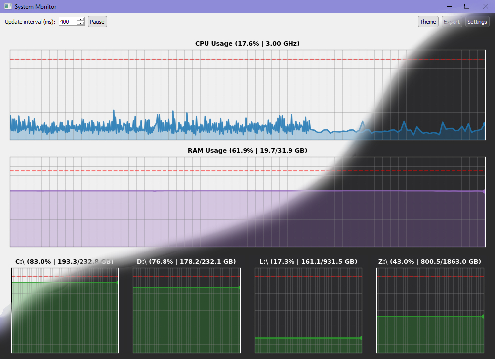
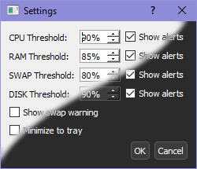

<div align="center">

# A-One-System-Monitor

Системный мониторинг для учебный практики

</div>

Программа мониторинга системных ресурсов в реальном времени, написанная на Python с использованием PyQt5. Отслеживает загрузку процессора, оперативной памяти, подкачки и дисков с визуализацией, настраиваемыми оповещениями и возможностью экспорта данных.

## Содержание
```
📁 edu_practice
├── 📁 img
│   ├── 🖼️ system_monitor.jpg
│   └── 🖼️ system_monitor_settings.jpg
├── 📁 src
│   ├── 🐍 main.py
│   └── 📄 requirements.txt
├── 📁 style
│   ├── 🖼️ dark_theme.qss
│   ├── 🖼️ default_theme.qss
│   └── 🖼️ sys-mon.ico
├── 📄 .gitignore
└── 📄 README.md
```

## Возможности

- **Графики в реальном времени** для CPU, RAM, Swap и подключённых дисков (объёмом ≥1 ГБ)
- **Настраиваемые пороги** с гибкими оповещениями
- **Интеграция в системный трей** с отображением текущей загрузки процессора и памяти
- **Пауза/возобновление** сбора данных
- **Тёмная/светлая темы**
- **Экспорт данных** в CSV (последний час)
- **Сохранение настроек** между запусками (интервалы, пороги, тема и т.д.)

## Скриншоты проекта (предварительной версии):





## Запуск

Чтобы запустить приложение имеется 2 способа:

**Использование собранного приложения (рекомендуется):**

1. Скачайте архив ["statosh-sys-mon.exe.zip"](https://github.com/statosh/A-One-System-Monitor/releases).
2. Распакуйте его в свободное место, например на рабочий стол.
3. Запустите приложение с помощью **statosh-sys-mon.exe**.
4. Пользуйтесь!

**Самому скомпилировать и запустить исходный код с помощью IDE или терминала PowerShell:**

Требования:
- Python 3.7+
- `PyQt5`
- `matplotlib`
- `psutil`

Установка зависимостей:
```bash
$ pip install PyQt5 matplotlib psutil
```

Запуск приложения: 
```bash
$ python main.py
```

Главное окно отображает текущую загрузку ресурсов. Настройки порогов и уведомлений можно изменить через меню **Settings** («Настройки»). Нажмите **Export** («Экспорт»), чтобы сохранить данные в папку `performance_log/`.

При сворачивании окно может скрываться в системный трей (настраивается). Двойной клик по иконкам в трее восстанавливает окно.